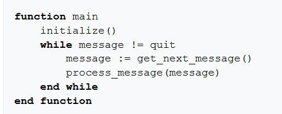

# Tutorials:

https://snarky.ca/how-the-heck-does-async-await-work-in-python-3-5/ (python 3.5 outofdate)

https://docs.python.org/3/library/asyncio.html#module-asyncio

https://aosabook.org/en/500L/a-web-crawler-with-asyncio-coroutines.html

https://markuseliasson.se/article/bittorrent-in-python/

https://charlesleifer.com/blog/building-a-simple-redis-server-with-python/

# Notes:

- Asyncio: Event loop framework that allowed for asynchronous programming
    - Event loop: Loop based on event occuring. loop until particular event 
        - E.g. JavaFX button has a onClick function
        - When `click happens --> Event loop is given clickEvent --> Do onClick(clickEvent)`
        - Use cases: GUIs, network I/O, executing code from thread, scheduling.
    - Types of asyncio: Polling, blocking, non-blocking, signals, etc.
    - Asyncio is the standard lib implementation of an event loop (with a focus on networking).
    - `async def` syntax: Define coroutine that can only return or await values
    - `await` expression: yield from but will not except generators that have not been flagged as coroutines
        - Awaitable object is either a coroutine or an object that defines `__await__()`; which returns an interator that is not a coroutine.
    - Why use async functions? --> Restricted coroutine that ensures you don't mix generator based coroutines and other generators that do not have specifically designed behaviour to act as a coroutine.

